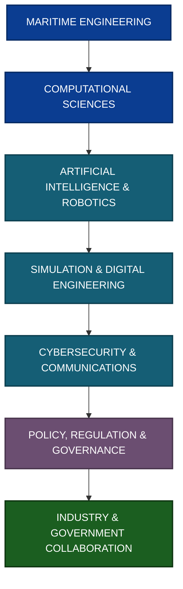
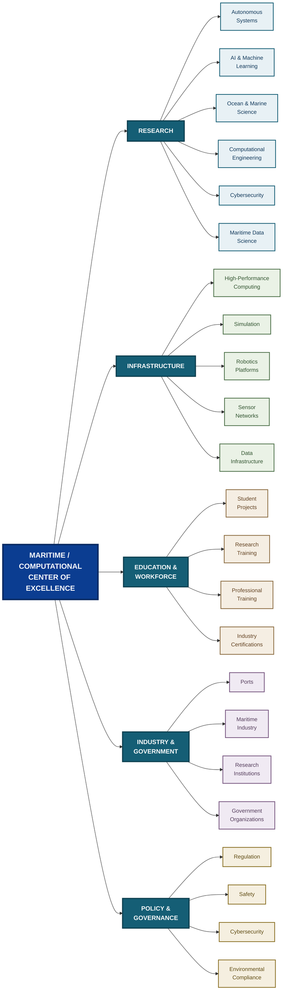
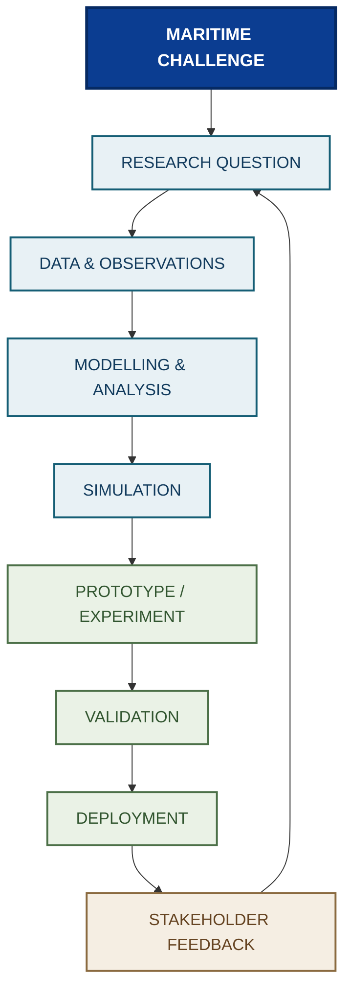
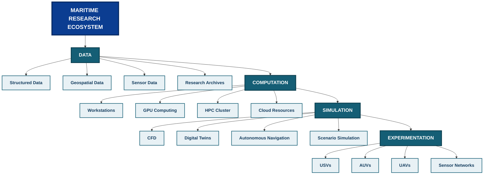
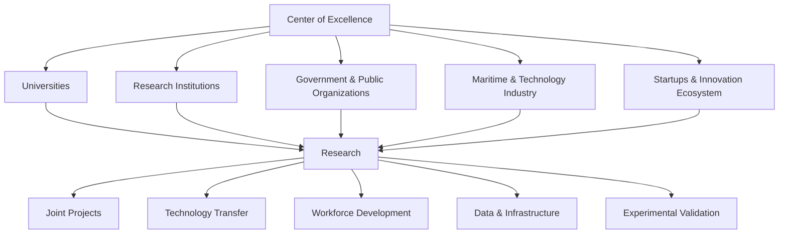
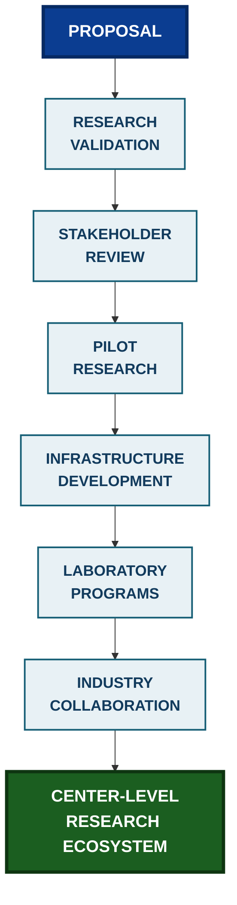

<div align="center">

# Maritime/Computational Center of Excellence at Andhra University

### A Research and Innovation Framework for Maritime, Naval, Computational, and Autonomous Systems

<p>
  <a href="https://github.com/ShazinHijazy/Maritime-CoE-Proposal">
    
  </a>
  <a href="https://github.com/ShazinHijazy/Maritime-CoE-Proposal">
    
  </a>
  <a href="https://github.com/ShazinHijazy/Maritime-CoE-Proposal">
    
  </a>
  <a href="https://github.com/ShazinHijazy/Maritime-CoE-Proposal/blob/main/LICENSE">
    
  </a>
</p>

<p>
  <strong>Andhra University · Visakhapatnam · Andhra Pradesh · India</strong>
</p>

<p>
  <em>
    A proposal-driven research framework for connecting maritime science,
    computational engineering, autonomous systems, cybersecurity,
    simulation, policy, and industry collaboration.
  </em>
</p>

</div>

---

## Table of Contents

* [Overview](#overview)
* [Motivation](#motivation)
* [Vision](#vision)
* [Problem Context](#problem-context)
* [Objectives](#objectives)
* [Research Domains](#research-domains)
* [Proposed Center Architecture](#proposed-center-architecture)
* [Research and Innovation Workflow](#research-and-innovation-workflow)
* [Technology Framework](#technology-framework)
* [Computational Infrastructure](#computational-infrastructure)
* [Maritime and Autonomous Systems](#maritime-and-autonomous-systems)
* [Regulatory and Compliance Dimension](#regulatory-and-compliance-dimension)
* [Regional Relevance of Visakhapatnam](#regional-relevance-of-visakhapatnam)
* [Gap Analysis](#gap-analysis)
* [Skill Development and Workforce](#skill-development-and-workforce)
* [Industry, Government, and Academic Collaboration](#industry-government-and-academic-collaboration)
* [Sustainability and Funding](#sustainability-and-funding)
* [Project Structure](#project-structure)
* [Project Team](#project-team)
* [Project Timeline](#project-timeline)
* [Documentation and Reports](#documentation-and-reports)
* [Research Methodology](#research-methodology)
* [Expected Outcomes](#expected-outcomes)
* [Limitations and Scope](#limitations-and-scope)
* [Future Development](#future-development)
* [References and Supporting Material](#references-and-supporting-material)
* [Contributing](#contributing)
* [License](#license)
* [Acknowledgements](#acknowledgements)

---

## Overview

The Maritime/Computational Center of Excellence at Andhra University is proposed as an interdisciplinary research and innovation initiative focused on the computational, technological, regulatory, and workforce dimensions of modern maritime systems.

The proposal investigates how a dedicated research center could bring together:

* Maritime engineering
* Naval and ocean technologies
* Artificial intelligence and machine learning
* Autonomous surface and underwater systems
* Computational fluid dynamics
* High-performance computing
* Maritime cybersecurity
* Digital simulation and digital twins
* Robotics and intelligent sensing
* Maritime data analytics
* Regulatory and policy research
* Industry-oriented skill development

The initiative is designed around the idea that modern maritime capability is increasingly dependent not only on physical infrastructure, but also on computation, data, autonomy, simulation, communication, cybersecurity, and interdisciplinary research.

The repository therefore serves as a structured research workspace for developing, validating, documenting, and refining the proposed Center of Excellence.

---

## Motivation

Maritime systems are becoming increasingly computational.

Autonomous navigation, vessel traffic analysis, environmental monitoring, simulation, predictive maintenance, maritime cybersecurity, ocean observation, and intelligent decision-support systems all depend on the ability to collect, process, model, and interpret large quantities of heterogeneous data.

A modern maritime research ecosystem therefore requires interaction between several disciplines rather than isolated engineering domains.

The proposed center seeks to provide such an interdisciplinary structure by connecting:



The repository documents the research and planning process supporting this proposal.

---

## Vision

> **To develop an interdisciplinary maritime research and innovation ecosystem at Andhra University capable of addressing real-world maritime challenges through computational science, autonomous systems, artificial intelligence, simulation, cybersecurity, and collaborative research.**

The proposed center is intended to function as a bridge between:

<div align="center">
  
|    Academic Research    |   Applied Engineering   |    Public Sector    |         Industry        |
| :---------------------: | :---------------------: | :-----------------: | :---------------------: |
|   Fundamental research  |       Prototyping       |   Maritime policy   |  Technology development |
| Computational modelling |    Autonomous systems   | National priorities | Commercial applications |
|     AI and robotics     |        Simulation       |      Regulation     |  Industrial deployment  |
|     Student research    | Experimental validation |    Infrastructure   |  Workforce development  |

</div>

## Problem Context

The maritime sector presents a combination of physical, computational, environmental, operational, and regulatory challenges.

Examples include:

* Autonomous navigation in dynamic environments
* Maritime traffic management
* Ocean and environmental monitoring
* Vessel and port optimization
* Maritime cybersecurity
* Computational modelling of marine systems
* High-performance simulation
* Sensor fusion
* Intelligent decision support
* Digital transformation of maritime operations
* Maritime workforce development
* Coordination between academic institutions and industry

These challenges require research environments where computational technologies can be evaluated against maritime problems.

The proposed Center of Excellence is therefore framed not as a single laboratory, but as an **interdisciplinary research and collaboration framework**.

---

## Objectives

The proposal is organized around the following objectives.

### 1. Maritime and Naval Computational Research

Investigate computational methods applicable to maritime and naval systems, including:

* Artificial intelligence
* Machine learning
* Computational fluid dynamics
* Numerical modelling
* Simulation
* Data analytics
* Optimization
* Autonomous systems

### 2. Maritime Technology Gap Analysis

Identify gaps in:

* Research infrastructure
* Computational capability
* Maritime technology development
* Academia-industry collaboration
* Workforce readiness
* Data availability
* Simulation facilities
* Policy and regulatory alignment

### 3. Regulatory and Legal Analysis

Study relevant Indian maritime, environmental, cybersecurity, data, and national-security frameworks that may influence the development and operation of maritime computational infrastructure.

### 4. Infrastructure Planning

Evaluate requirements for:

* High-performance computing
* Cloud computing
* Simulation environments
* Data infrastructure
* Robotics platforms
* Sensor systems
* Communication infrastructure
* Cybersecurity infrastructure

### 5. Workforce Development

Develop pathways for students, researchers, engineers, and professionals to acquire maritime computational skills.

### 6. Collaboration

Create mechanisms for interaction between:

* Universities
* Government organizations
* Research institutions
* Maritime organizations
* Defence and naval stakeholders
* Ports and logistics organizations
* Technology companies
* Startups

---

## Research Domains

The proposed center can be organized around several interconnected research domains.

<div align="center">

|             Domain            | Representative Research                           |
| :---------------------------: | :------------------------------------------------ |
|       Autonomous Systems     | ASVs, AUVs, UAVs, autonomous navigation           |
|     Artificial Intelligence  | ML, perception, decision-making, prediction       |
|          Ocean Systems       | Ocean observation, environmental monitoring       |
|    Computational Engineering | CFD, numerical modelling, optimization            |
|   High-Performance Computing | Parallel computation, large-scale simulation      |
|     Maritime Cybersecurity   | Secure communication, threat analysis, resilience |
|         Sensor Networks      | Sensor fusion, distributed sensing, telemetry     |
|         Remote Sensing      | Satellite and aerial maritime observation         |
|     Port and Vessel Systems   | Traffic, logistics, optimization                  |
|      Maritime Data Science   | AIS, environmental, operational datasets          |
|       Digital Engineering    | Digital twins, simulation, virtual testing        |
|      Policy and Regulation   | Maritime governance and compliance                |

</div>

## Proposed Center Architecture

The proposed organizational architecture connects strategic direction, research infrastructure, laboratories, collaboration, and education.



The architecture is intentionally modular. Individual laboratories or research programs can be developed incrementally without requiring the complete center to become operational at once.

---

## Research and Innovation Workflow

A central principle of the proposal is the conversion of maritime problems into research questions, computational models, experimental systems, and validated engineering outcomes.



This workflow supports an iterative research cycle rather than a one-directional technology pipeline.

---

## Technology Framework

The computational ecosystem proposed for the center spans data acquisition, modelling, simulation, artificial intelligence, visualization, and collaboration.

<div align="center">

|         Layer        | Technologies / Tools                           |
| :------------------: | :--------------------------------------------- |
|      Programming     | Python, R, MATLAB                              |
| Scientific Computing | NumPy, Pandas, SciPy                           |
|   Machine Learning   | Scikit-learn, TensorFlow, PyTorch              |
|     Data Analysis    | Jupyter, OpenRefine                            |
|     Visualization    | Matplotlib, Tableau and related tools          |
|       Robotics       | ROS / ROS 2 and compatible robotics frameworks |
|      Simulation      | CFD and physics-based simulation platforms     |
|          HPC         | Cluster and parallel computing environments    |
|         Cloud        | Cloud-based compute and storage                |
|    Version Control   | Git and GitHub                                 |
|     Documentation    | Markdown, Jupyter, technical reports           |
|     Collaboration    | GitHub and collaborative documentation systems |

</div>

The exact technology stack should remain adaptable to research requirements, licensing constraints, institutional infrastructure, and available funding.

---

## Computational Infrastructure

A mature maritime computational research environment could consist of several infrastructure layers.



Infrastructure development should follow a staged approach, beginning with research capability and expanding toward dedicated laboratories and larger computational resources as funding and research demand increase.

---

## Maritime and Autonomous Systems

Autonomous maritime systems represent an important research direction for the proposed center.

Potential platforms include:

* Autonomous Surface Vehicles
* Autonomous Underwater Vehicles
* Unmanned Aerial Vehicles for maritime observation
* Remotely operated systems
* Distributed sensor platforms
* Autonomous navigation systems
* Multi-robot maritime systems

A generic autonomous maritime system can be represented as:

$$
\mathcal{S} =
\left(
\mathcal{P},
\mathcal{E},
\mathcal{C},
\mathcal{A}
\right)
$$

where:

* $\mathcal{P}$ represents the physical platform,
* $\mathcal{E}$ represents environmental observations,
* $\mathcal{C}$ represents computation and control,
* $\mathcal{A}$ represents the resulting autonomous actions.

This formulation is intentionally generic and can be adapted to different maritime robotic platforms.

---

## Regulatory and Compliance Dimension

The proposed center includes a dedicated regulatory and governance component because maritime technologies operate within a complex legal and institutional environment.

The research framework considers areas such as:

* Maritime regulation
* Environmental protection
* Data governance
* Cybersecurity
* National security
* Autonomous-system governance
* Research ethics
* Safety requirements
* Sensitive-data handling

The repository includes supporting research material related to Indian government regulations and maritime/naval computation.

> **Important:** Regulatory material in this repository should be treated as research documentation rather than legal advice. Applicable laws, rules, notifications, standards, and institutional requirements should be independently verified before operational or policy decisions are made.

---

## Regional Relevance of Visakhapatnam

Visakhapatnam provides a strategically relevant environment for a maritime-oriented research initiative because of its broader maritime, port, industrial, academic, and defence ecosystem.

The proposal therefore considers the regional context when evaluating:

* Maritime research opportunities
* Port and logistics applications
* Autonomous systems
* Ocean observation
* Industrial collaboration
* Workforce development
* Research infrastructure
* Technology transfer

The objective is not simply to replicate an existing international model, but to develop a framework that responds to regional research and engineering requirements.

---

## Gap Analysis

The project uses gap analysis to compare existing capabilities against the requirements of a modern maritime computational research ecosystem.

A conceptual capability gap can be expressed as:

$$
G_i = R_i - C_i
$$

where:

* $G_i$ is the capability gap for dimension $i$,
* $R_i$ represents the required capability,
* $C_i$ represents the current capability.

The dimensions may include:

* Infrastructure
* Human resources
* Computational capacity
* Research output
* Industry collaboration
* Data availability
* Simulation capability
* Regulatory readiness

The equation is a conceptual analytical representation rather than a predefined quantitative score for the center.

---

## Skill Development and Workforce

A Center of Excellence should develop people alongside infrastructure.

Potential training areas include:

### Computational Skills

* Scientific Python
* Numerical methods
* Data science
* Machine learning
* High-performance computing
* Statistical modelling

### Maritime Technology

* Maritime systems
* Navigation
* Ocean sensing
* Vessel systems
* Port operations
* Marine robotics

### Robotics

* ROS / ROS 2
* Sensor fusion
* Autonomous navigation
* Motion control
* Embedded systems
* Multi-robot systems

### Engineering Simulation

* CFD
* Numerical simulation
* Digital twins
* System modelling
* Optimization

### Professional Skills

* Technical documentation
* Research methodology
* Scientific communication
* Project management
* Industry collaboration

---

## Industry, Government, and Academic Collaboration

The proposed center is designed around a collaborative model.



Potential collaboration mechanisms include:

* Joint research projects
* Sponsored research
* Student internships
* Industry-defined research problems
* Shared laboratories
* Technology demonstrations
* Training programs
* Research fellowships
* Data-sharing agreements
* Joint publications
* Technology transfer

---

## Sustainability and Funding

Long-term sustainability should not depend on a single funding source.

Potential funding mechanisms include:

<div align="center">

|    Funding Mechanism   | Potential Purpose                    |
| :--------------------: | :----------------------------------- |
|    Government Grants   | Infrastructure and research programs |
|   Sponsored Research   | Industry-specific research           |
| Academic Collaboration | Joint research and facilities        |
|  Research Fellowships  | Student and researcher development   |
|    Training Programs   | Workforce development                |
|       Consultancy      | Applied engineering and analysis     |
|   Technology Transfer  | Commercialization of research        |
|   Innovation Programs  | Prototyping and startups             |

</div>

A sustainable operating model can be considered as:

$$
\mathcal{F}_{total} =
\mathcal{F}*{gov}
+
\mathcal{F}*{industry}
+
\mathcal{F}*{research}
+
\mathcal{F}*{training}
+
\mathcal{F}_{services}
$$

where the terms represent different potential funding streams.

This equation describes a diversification principle rather than a financial forecast.

---

## Project Structure

The repository currently follows a research-documentation structure:

```text
Maritime-CoE-Proposal/
│
├── docs/
│   ├── Current Maritime Technologies.txt
│   ├── Government Regulations Related to Maritime and Naval Computation in India.pdf
│   ├── maritime_computational_center_proposal.md
│   ├── mentor-feedback.md
│   ├── proposal-draft.md
│   └── research-reports.md
│
├── reports/
│   ├── Center Proposal-3-8.pdf
│   ├── Government Regulations Related to Maritime and Naval Computation in India.pdf
│   ├── advantage-vizag.pdf
│   └── gap-analysis.pdf
│
├── src/
│   ├── notebooks/
│   └── scripts/
│
├── LICENSE
├── README.md
└── project-board.md
```

The repository separates proposal documentation, research reports, and computational work so that the project can evolve from a planning document into a more reproducible research environment.

---

## Project Team

The current proposal documentation identifies the following project roles:

<div align="center">

|              Member              |                   Role                   |
| :------------------------------: | :--------------------------------------: |
| **Dr. Giri Rajasekhar Gunnu** |          Project Mentor       |
| **Mohamed Hijazy Shazin Hassan** |          Project Management Lead         |
|      **Vinay Kumar Tadela**      | Operations Lead and Research Contributor |
|        **Moksa Namburu**        |               Research Lead              |

</div>

### Project Mentor

**Dr. Giri Rajasekhar Gunnu**

Responsible for overall project stratergy, proposal review, vision, higher level planning, project mentorship and guidance.

### Project Management Lead

**Mohamed Hijazy Shazin Hassan**

Responsible for overall project coordination, proposal development, communication, planning, and project lifecycle management.

### Operations Lead and Research Contributor

**Vinay Kumar Tadela**

Responsible for operational research, analysis of global Centers of Excellence, maritime computational technologies, and supporting proposal development.

### Research Lead

**Moksa Namburu**

Responsible for research into maritime and naval computational ecosystems, technological trends, regulatory frameworks, and regional capability gaps.

The roles documented here reflect the current proposal material and may evolve as the initiative develops.

---

## Project Timeline

The proposal documentation records the following initial development timeline.

<div align="center">

|              Milestone             |        Date        |
| :--------------------------------: | :----------------: |
|           Kickoff Meeting          |  January 21, 2025  |
|   Centers of Excellence Research   |  January 24, 2025  |
|           Data Validation          |  January 27, 2025  |
|          Mentor Validation         |  January 28, 2025  |
|        Data Collection Start       |  January 28, 2025  |
| Data Compilation and Visualization | February 1–3, 2025 |
|    Proposal Drafting and Review    | February 3–6, 2025 |
|     Initial Proposal Submission    |  February 10, 2025 |

</div>

These dates describe the initial proposal-development phase rather than a commitment to the operational establishment of the center.

---

## Documentation and Reports

The repository contains supporting documents covering different dimensions of the proposal.

### Proposal Documentation

* [`maritime_computational_center_proposal.md`](docs/maritime_computational_center_proposal.md)
* [`proposal-draft.md`](docs/proposal-draft.md)
* [`mentor-feedback.md`](docs/mentor-feedback.md)
* [`research-reports.md`](docs/research-reports.md)

### Research Reports

* [`Center Proposal-3-8.pdf`](reports/Center%20Proposal-3-8.pdf)
* [`gap-analysis.pdf`](reports/gap-analysis.pdf)
* [`advantage-vizag.pdf`](reports/advantage-vizag.pdf)
* [`Government Regulations Related to Maritime and Naval Computation in India.pdf`](reports/Government%20Regulations%20Related%20to%20Maritime%20and%20Naval%20Computation%20in%20India.pdf)

### Source Material

* [`Current Maritime Technologies.txt`](docs/Current%20Maritime%20Technologies.txt)

---

## Research Methodology

The research process is structured around six broad stages.

### Stage 1: Environmental Scan

Identify:

* Existing maritime research capabilities
* International Centers of Excellence
* Emerging maritime technologies
* Computational research trends
* Relevant institutions and organizations

### Stage 2: Regional Assessment

Evaluate:

* Regional maritime infrastructure
* Research capabilities
* Industry presence
* Academic capabilities
* Existing technology ecosystems

### Stage 3: Gap Analysis

Compare existing capabilities against identified requirements.

### Stage 4: Regulatory Review

Study applicable legal, regulatory, environmental, cybersecurity, and institutional frameworks.

### Stage 5: Center Design

Develop:

* Research themes
* Infrastructure requirements
* Workforce programs
* Collaboration models
* Funding mechanisms
* Governance structures

### Stage 6: Validation

Validate the proposal through:

* Mentor feedback
* Literature review
* Institutional review
* Stakeholder feedback
* Technical feasibility analysis

---

## Expected Outcomes

If developed further, the proposal could support the creation of a structured ecosystem for:

* Maritime computational research
* Autonomous maritime systems
* Ocean and environmental monitoring
* Maritime AI
* Computational engineering
* Maritime cybersecurity
* Simulation and digital engineering
* Student research
* Industry-oriented training
* Government and academic collaboration

The intended outcome is not simply the creation of another laboratory, but a **research and innovation ecosystem connecting computational capability with real maritime problems**.

---

## Limitations and Scope

This repository represents a **proposal and research-planning initiative**.

It should not be interpreted as evidence that:

* The proposed Center of Excellence has already been formally established.
* All proposed infrastructure has already been procured.
* All proposed partnerships have been finalized.
* All regulatory approvals have been obtained.
* All proposed research programs are operational.

The scope of the repository is primarily:

**research → analysis → proposal → validation → future implementation**

rather than representing an operational maritime facility.

---

## Future Development

Future repository development may include:

### Research Infrastructure

* Structured maritime datasets
* AIS data processing
* Geospatial analysis
* Oceanographic datasets
* Simulation environments

### Computational Research

* Maritime traffic modelling
* Autonomous navigation simulations
* CFD experiments
* Maritime machine learning
* Optimization frameworks

### Robotics

* Autonomous Surface Vehicle simulation
* Autonomous Underwater Vehicle research
* Maritime sensor fusion
* Multi-robot coordination
* Hardware-in-the-loop testing

### Visualization

* Interactive maritime dashboards
* Geospatial visualization
* Capability-gap dashboards
* Infrastructure planning tools

### Documentation

* Formal Center architecture
* Laboratory specifications
* Governance framework
* Funding strategy
* Research roadmap
* Industry collaboration framework

---

## Research Roadmap

The longer-term development can be represented as:



This roadmap intentionally separates proposal development from implementation.

---

## References and Supporting Material

The repository includes research material covering:

* Maritime computational technologies
* Indian maritime and naval regulatory considerations
* Global Centers of Excellence
* Regional maritime opportunities
* Capability-gap analysis
* Proposal development
* Mentor feedback

External standards, regulations, datasets, and technical references should be cited at the point where they are used in future research documents.

For regulatory or policy-sensitive work, primary government and institutional sources should be preferred over secondary summaries.

---

## Reproducibility

Where computational analysis is introduced, the project should aim to maintain:

* Clearly identified datasets
* Data provenance
* Version-controlled scripts
* Reproducible notebooks
* Explicit assumptions
* Documented preprocessing
* Reproducible figures and tables
* Versioned research reports

A general research reproducibility chain is:

$$
\text{Source Data}
\rightarrow
\text{Processing}
\rightarrow
\text{Analysis}
\rightarrow
\text{Visualization}
\rightarrow
\text{Report}
$$

This approach helps distinguish evidence-backed findings from conceptual recommendations.

---

## Contributing

Contributions can focus on improving the research quality, technical depth, documentation, or reproducibility of the project.

Useful contributions include:

* Literature reviews
* Maritime technology analysis
* Regulatory research
* Gap-analysis methodology
* Computational notebooks
* Data analysis
* Simulation models
* Architecture diagrams
* Research documentation
* Technical review

For substantial changes, open an issue first to discuss the proposed direction.

---

## Citation

If this repository is referenced in academic, institutional, or research work, please cite the repository appropriately.

```bibtex
@misc{shazin_maritime_coe,
  author       = {Mohamed Hijazy Shazin Hassan},
  title        = {Maritime/Computational Center of Excellence Proposal},
  year         = {2025},
  publisher    = {GitHub},
  url          = {https://github.com/ShazinHijazy/Maritime-CoE-Proposal}
}
```

The citation metadata should be updated if the project later receives a formal publication, institutional report number, DOI, or other persistent identifier.

---

## License

This project is released under the **MIT License**.

See [`LICENSE`](LICENSE) for the complete license text.

---

## Acknowledgements

The development of this proposal involves research into maritime technology, computational engineering, regulatory frameworks, regional capabilities, and Centers of Excellence.

The project also recognizes the importance of academic mentorship, institutional collaboration, government research, maritime organizations, and the wider open-source and research communities in advancing interdisciplinary maritime technology.

---

<div align="center">

### Maritime Research × Computational Intelligence × Autonomous Systems

**Building a research framework for the next generation of maritime technology.**

<br>

<a href="https://github.com/ShazinHijazy">
  
</a>

<a href="https://github.com/ShazinHijazy/Maritime-CoE-Proposal">
  
</a>

</div>
